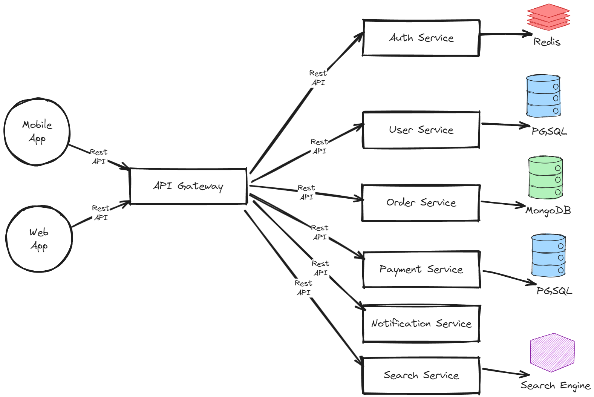

# Microservices Architecture Document

## Table of Contents
1. [Introduction](#introduction)
2. [System Overview](#system-overview)
3. [High-Level Architecture](#high-level-architecture)
4. [Service Descriptions](#service-descriptions)
5. [Technology Stack](#technology-stack)
6. [API Design](#api-design)
7. [Security Considerations](#security-considerations)
8. [Scalability and Performance](#scalability-and-performance)
9. [Deployment Strategy](#deployment-strategy)
10. [Monitoring and Logging](#monitoring-and-logging)
11. [Appendices](#appendices)

## 1. Introduction

**Purpose:**
This document outlines the architecture for a microservices-based e-commerce platform, detailing the system components, interactions, technology stack, and various architectural considerations.

**Scope:**
This architecture is designed to support scalable, secure, and maintainable operations for an e-commerce platform, focusing on core functionalities such as user management, product catalog, order processing, and payment handling.

**Audience:**
This document is intended for software architects, developers, DevOps engineers, and other technical stakeholders involved in the project.

## 2. System Overview

The e-commerce platform is designed to provide an intuitive and robust online shopping experience. It supports user registration, product catalog browsing, cart management, order processing, payment transactions, and notifications.

## 3. High-Level Architecture

**Diagram:**


**Description:**
The system is divided into several microservices, each responsible for a specific domain of functionality. An API Gateway routes requests to the appropriate services, ensuring load balancing, security, and API management.

## 4. Service Descriptions

**API Gateway:**
- **Responsibilities:** Routing, load balancing, authentication, and rate limiting.
- **Technology:** NGINX, Kong, or AWS API Gateway.

**Authentication Service:**
- **Responsibilities:** User authentication and authorization.
- **Technology:** OAuth2, JWT, Spring Security.

**User Service:**
- **Responsibilities:** User registration, profile management.
- **Technology:** Java (Spring Boot), MySQL.

**Product Service:**
- **Responsibilities:** Product catalog management (CRUD operations).
- **Technology:** Node.js (Express.js), MongoDB.

**Order Service:**
- **Responsibilities:** Order creation, status tracking.
- **Technology:** Python (Flask), PostgreSQL.

**Payment Service:**
- **Responsibilities:** Handling payment transactions.
- **Technology:** Java (Spring Boot), Stripe/PayPal API.

**Notification Service:**
- **Responsibilities:** Sending notifications via email and SMS.
- **Technology:** Node.js (Express.js), Twilio.

**Search Service:**
- **Responsibilities:** Product search functionality.
- **Technology:** Elasticsearch.

## 5. Technology Stack

**Programming Languages:**
- Java, Python, Node.js

**Frameworks:**
- Spring Boot, Express.js, Flask

**Databases:**
- MySQL, MongoDB, PostgreSQL

**Containerization:**
- Docker

**Orchestration:**
- Kubernetes

**Cloud Providers:**
- AWS, Azure, GCP

**CI/CD:**
- Jenkins, GitHub Actions

**Monitoring:**
- Prometheus, Grafana

**Logging:**
- ELK Stack (Elasticsearch, Logstash, Kibana)

## 6. API Design

**User Service API:**

- **GET /api/users:** Retrieve all users.
- **GET /api/users/{id}:** Retrieve user by ID.
- **POST /api/users:** Create a new user.
- **PUT /api/users/{id}:** Update user details.
- **DELETE /api/users/{id}:** Delete user.

**Sample Endpoint:**

- **Endpoint:** `/api/users`
  - **Method:** GET
  - **Description:** Retrieve all users.
  - **Response:**
    ```json
    [
      {
        "id": "123",
        "name": "John Doe",
        "email": "john@example.com"
      },
      ...
    ]
    ```

## 7. Security Considerations

- **Authentication:** Use OAuth2 and JWT for secure authentication and authorization.
- **Encryption:** Implement SSL/TLS for data transmission.
- **Compliance:** Ensure compliance with GDPR and PCI-DSS for data protection.

## 8. Scalability and Performance

- **Horizontal Scaling:** Use Kubernetes for automatic scaling of services.
- **Load Balancing:** Implement load balancing at the API Gateway level.
- **Caching:** Use Redis or Memcached to cache frequently accessed data.

## 9. Deployment Strategy

- **Continuous Integration/Continuous Deployment (CI/CD):** Use Jenkins or GitHub Actions to automate testing and deployment.
- **Environment Setup:** Use Docker and Kubernetes for consistent deployment environments.
- **Rollout Strategy:** Implement blue-green or canary deployments for smooth updates.

## 10. Monitoring and Logging

- **Monitoring Tools:** Use Prometheus and Grafana for system monitoring and alerting.
- **Logging Tools:** Use the ELK stack (Elasticsearch, Logstash, Kibana) for centralized logging and log analysis.

## 11. Appendices

- **Glossary:** Definitions of key terms and acronyms.
- **References:** Links to relevant documents and resources.
